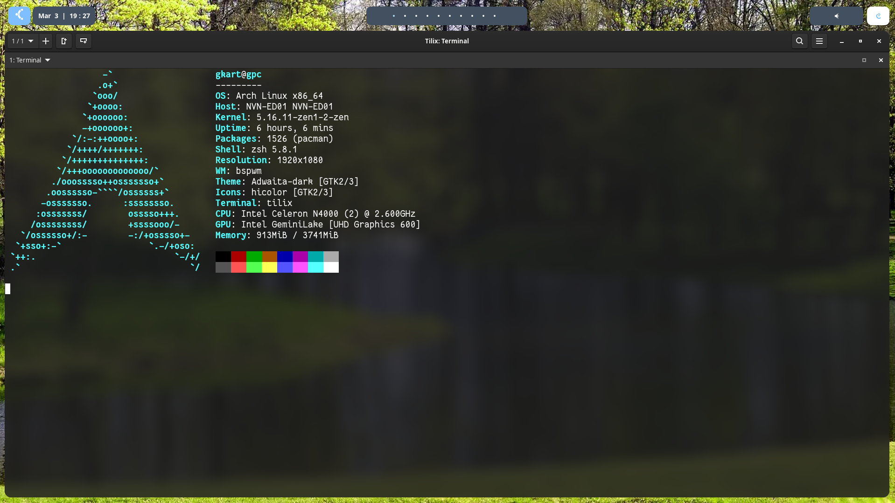
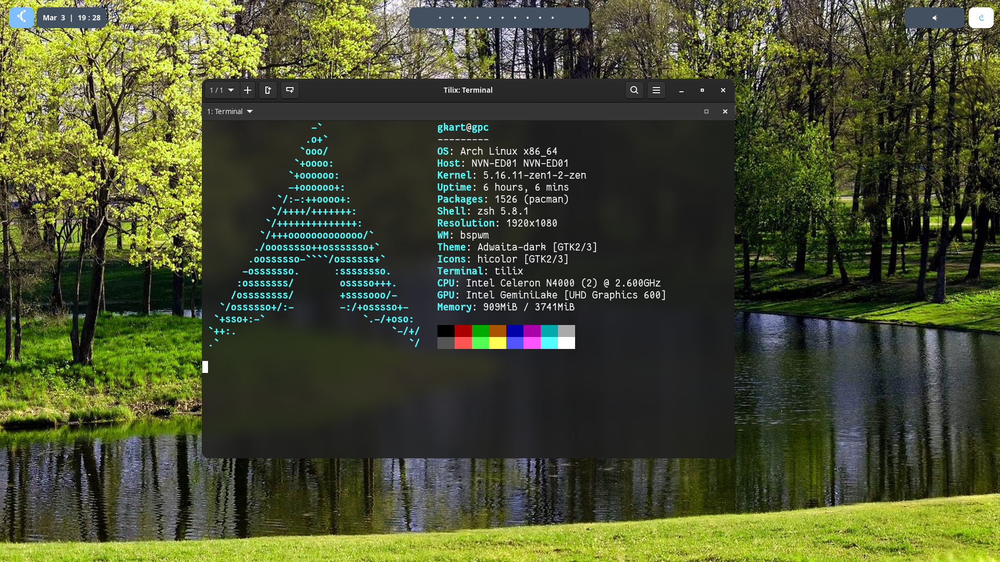

# my personal dotfiles backup

This is my configuration that I use for my day to day and there may be people who do not like it, if that happens, avoid complaining and just use other dotfiles or make your own   
**this guide is designed for arch linux but if it succeeds install the required packages without problem this guide will work on any distribution based on linux**

# requeriments

- bspwm
- sxhkd
- rofi
- tilix
- picom
- polybar
- feh
- zsh
- oh-my-zsh
- slim
- bat
- lsd

# install

- 1. git clone https://github.com/GKart/dotfiles   
- 2. cd dotfiles
- 3. mkdir ~/.config/bspwm
- 4. mkdir ~/.config/sxhkd   
- 5. cp -r sxhkd ~/.config/
- 6. cp -r bspwm ~/.config/
- 7. chmod +x ~/.config/bspwm/bspwmrc
- 8. chmod +x ~/.config/sxhkd/sxhkdrc
- 9. mkdir ~/.config/feh
- 10. cp images/wallpaper.jpg ~/.config/feh/ # to change the wallpaper remplace wallpaper
- 11. cp -r polybar ~/.config/
- 12. cp -r polybar/truetype /usr/share/fonts/
- 13. mkdir ~/.config/picom
- 14. cp picom/picom.conf ~/.config/picom/
- 15. git clone --depth=1 https://github.com/romkatv/powerlevel10k.git ~/powerlevel10k
- 16. echo 'source ~/powerlevel10k/powerlevel10k.zsh-theme' >>~/.zshrc
- 17. zsh # When doing this it will ask you for different appearance options, configure as you prefer and execute exit once finished
- 18. chsh -s $(which zsh) # this set zsh by default
- 19. add this to hour ~/zshrc.mk

   alias cat="/bin/bat"   
   alias ls="/bin/lsd"

- 20. Enjoy!

# basic shorcuts [check ~/.config/sxhkd/sxhkdrc to see all shorcuts]

- alt + t [open tilix]
- super + enter [open rofi]
- super + t/s [change tiled window to floting window]
- super + Left/Down/Up/Right [move the window in floting mode]

# Here I show you some screenshots of an approximate of how the result looks

